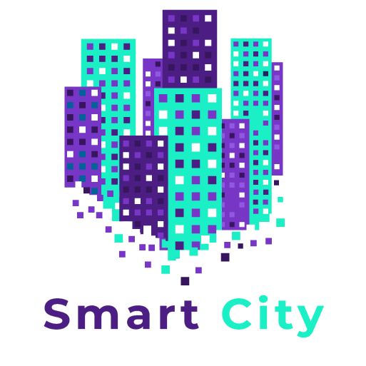
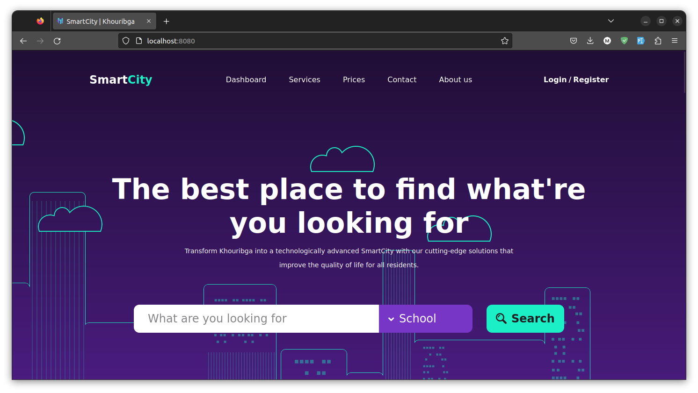

<div align="center" id="top">
  <a href="">
    
  </a>

  <h3 align="center">Khouribga Smart City</h3>

  <p align="center">
    Make the citizen's life much easier...
    <br />
    <br />
    <a href="#contribute">Contribute</a>
    ·
    <a href="https://github.com/ez7mz/smartcity/issues">Report Bug</a>
    ·
    <a href="https://ez7mz.github.io/smartcity/doc/java-doc/">Java-Doc</a>
  </p>

  
  
  
  
  
  
  
  

</div>

## What is all about ?
The objective of the Smart City project is to create a web app that provides useful information to visitors of the city of Khouribga. We have noticed that many newcomers, such as students, business travelers, and tourists, are not familiar with the services available in the city. That's why we have created a website that gathers all the necessary information about Khouribga, including tourist attractions, schools, transportation services, local businesses, and accommodations.

---

## SmartCity App Showcase



## Environment variables
| Variable | Description | Default value |
| :---: | :---: | :---: |
| `DATABASE_URI` | MySQL database URL | `jdbc:mysql://(localhost\|mysqldb):3306/smartcity?createDatabaseIfNotExist=true` |
| `DATABASE_USER` | MySQL database username | `root` |
| `DATABASE_PASSWORD` | MySQL database password | `ez7mz` |
| `MAIL_HOST` | Maildev host | `localhost` | `maildev` |
| `MAIL_PORT` | Maildev port | `1025` |

## To run the project on your own
### Prerequisites
- Laptop or PC
- openJDK 17 [Download](https://jdk.java.net/17/)
- MySQL 8 [Download](https://dev.mysql.com/downloads/mysql/) or [Run with docker](https://hub.docker.com/_/mysql)
- Maven 3.8 [Download](https://maven.apache.org/download.cgi)
- Maildev [Download](https://maildev.github.io/maildev/) or [Run with docker](https://hub.docker.com/r/maildev/maildev)
- Internet connection
- Hands

### Installation

1. Install dependencies and build the project
   ```shell
        $ mvn clean
        $ mvn install -DskipTests
    ```
2. Run the project
   ```shell
   $ java -jar target/target/smartcity-0.0.1-SNAPSHOT.jar
   ```
   **Note:** The project will run on port 8080 by default, you can change it by adding the following line to the `application.yml` file
   ```properties
    server.port=8081
    ```
    Also an ADMIN account will be created with the following credentials
    ```properties
    email: root@root.com
    password: root
    ```
3. Enjoy
4. Don't forget to star ⭐ the repo if you like it 😊

## To run the project on docker
```shell
	$ docker-compose build
	$ docker-compose up
    # to stop the containers
    $ docker-compose down
```

<h2 id="contribute">Contributions</h2>

Contributions are what make the open source community such an amazing place to be learn, inspire, and create. Any contributions you make are greatly appreciated.

- Fork the repo
- Create a new branch (`git checkout -b feature/AmazingFeature`)
- Make your changes and add them (`git add .`)
- Commit and push your changes (`git commit -m 'Add some AmazingFeature' && git push origin feature/AmazingFeature`)
- Create a new pull request 🤩
- And that's it 😊
- Don't forget to star ⭐ the repo if you like it 😊

## License

Distributed under the MIT License. See `LICENSE` for more information.

## Contact Information

- Devs : mesrarhamza48@gmail.com && ynabouzi.me@gmail.com
---